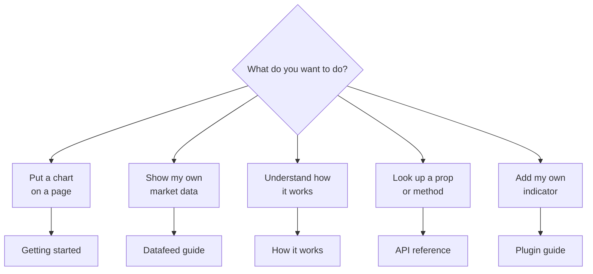
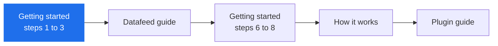

# Astroneum documentation

Pick the guide that matches what you are trying to do.

| Guide | Read it when | Time |
|---|---|---|
| [Getting started](./getting-started.md) | you are new. Ten small steps from an empty folder to a live chart, with a picture of what you should see after each | 20 min |
| [How it works](./architecture.md) | you want the mental model: the parts, how data flows, how chart types and indicators are made, how releases happen | 15 min |
| [Datafeed guide](./datafeed-guide.md) | you want to connect a REST API or WebSocket | 15 min |
| [API reference](./api.md) | you need the exact name or type of something | lookup |
| [Plugin guide](./plugin-development.md) | the built-in indicators are not enough | 30 min |

## Learning path

Start at the blue box. You can stop after the first two boxes and have a working chart on
your own data.

## Also useful

- **Live demo:** [every chart type on live data](https://kowito.github.io/astroneum/demo/)
- **Changelog:** [what changed in each version](../CHANGELOG.md)
- **Contributing:** [set up the repo, run the checks](../CONTRIBUTING.md)
