# How it works

A picture of the parts of Astroneum and how data moves through them. Read this when
you want to know *why* the chart behaves the way it does, or before changing the code.
To just use the chart, start with [Getting started](./getting-started.md).

**Contents:**
[The big picture](#the-big-picture) ·
[What is on screen](#what-is-on-screen) ·
[The life of data](#the-life-of-data) ·
[Chart types](#chart-types) ·
[Indicators](#indicators) ·
[The history cache](#the-history-cache) ·
[Where the code lives](#where-the-code-lives) ·
[Releases and deploys](#releases-and-deploys) ·
[Words used in these docs](#words-used-in-these-docs)

---

## The big picture

Astroneum is a React component on top of a drawing engine. Your app gives it a
**datafeed** (where the bars come from) and settings; the engine turns bars into pixels.

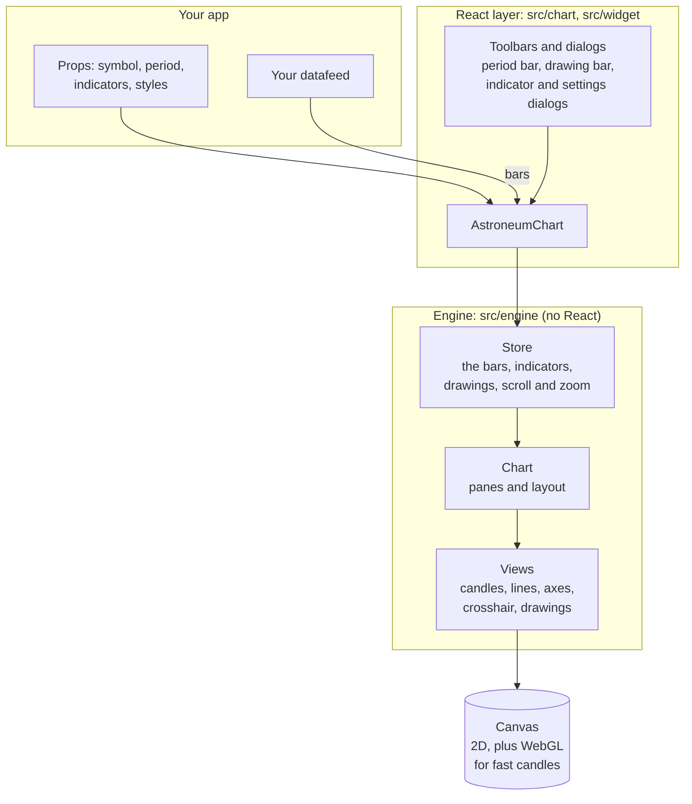

Why it is split this way:

- **The engine knows nothing about React.** It takes a container element and draws into it.
  That keeps the drawing code fast and testable, and leaves the door open for other frameworks.
- **The React layer is glue.** It creates the engine, passes props in, and renders the
  dialogs and toolbars around the canvas.
- **The datafeed is the only thing you must provide.** Everything else has a default.

## What is on screen

```text
┌──────────────────────────────────────────────────────────────────────┐
│  PERIOD BAR   BTC   1m 5m 15m 1H 4H D    Indicator  Settings  ...    │
├────┬─────────────────────────────────────────────────────┬───────────┤
│ D  │                                                     │  price    │
│ R  │              MAIN PANE  (candle_pane)               │  axis     │
│ A  │      candles or line + overlay indicators           │           │
│ W  │      + the drawings you add                         │ 86,400    │
│ I  │                                                     │ 86,200    │
│ N  ├─────────────────────────────────────────────────────┤           │
│ G  │  SUB-PANE: VOL                                      │           │
│    ├─────────────────────────────────────────────────────┤           │
│ B  │  SUB-PANE: RSI          (drag a divider to resize)  │           │
│ A  ├─────────────────────────────────────────────────────┴───────────┤
│ R  │                       TIME AXIS                                  │
└────┴──────────────────────────────────────────────────────────────────┘
```

| Part | What it is | Where |
|---|---|---|
| Period bar | timeframe buttons, indicator and settings buttons | `src/widget/period-bar` |
| Drawing bar | the tools on the left: lines, Fibonacci, Gann, measure... | `src/widget/drawing-bar` |
| Main pane | the price chart; overlay indicators (EMA, BOLL) draw here | `src/engine/pane/CandlePane.ts` |
| Sub-panes | one per sub-indicator; each has its own price axis | `src/engine/pane/IndicatorPane.ts` |
| Time axis | shared by every pane, so scrolling moves them together | `src/engine/pane/XAxisPane.ts` |

Every pane stacks a **main canvas** for the data (bars, lines, indicator values) and an
**overlay canvas** on top for things that change constantly (the crosshair, the drawing
you are making). The overlay repaints without redrawing all the bars.

## The life of data

### First load

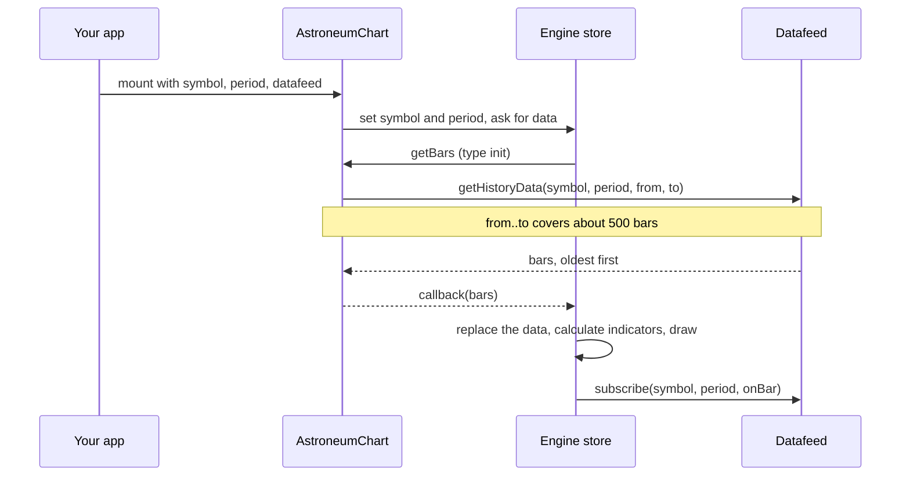

### Live updates

Once subscribed, the datafeed calls the chart's callback with the newest bar. The chart
compares timestamps with the last bar it has:

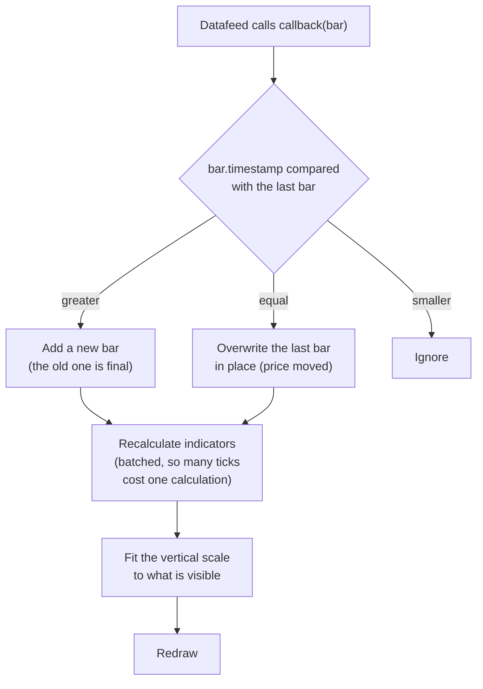

Two details worth knowing:

- Recalculation is **batched**. If ten ticks arrive in the same instant, indicators are
  calculated once with the latest data, not ten times.
- A tick that only changes the last bar takes a lighter layout path than a new bar, because
  the axis width cannot have changed.

### Scrolling back in time

When you pan until the first loaded bar is on screen, the chart asks for older data:

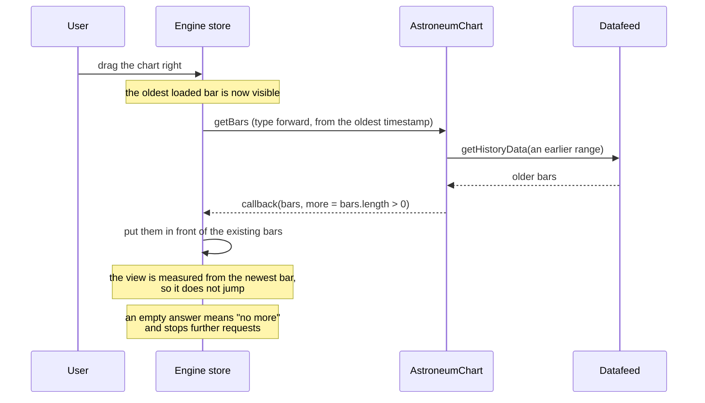

The engine also has a "backward" request, for bars *newer* than the last one. Newer bars
arrive through `subscribe`, so the chart answers it with an empty result immediately.

## Chart types

There are two families, and the family decides how you set it up.

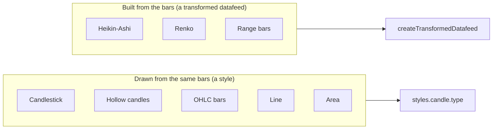

### How a derived chart stays live

`createTransformedDatafeed` sits between the chart and your datafeed. It keeps the raw
bars, re-derives the series on every tick, and passes the chart only what *changed*.

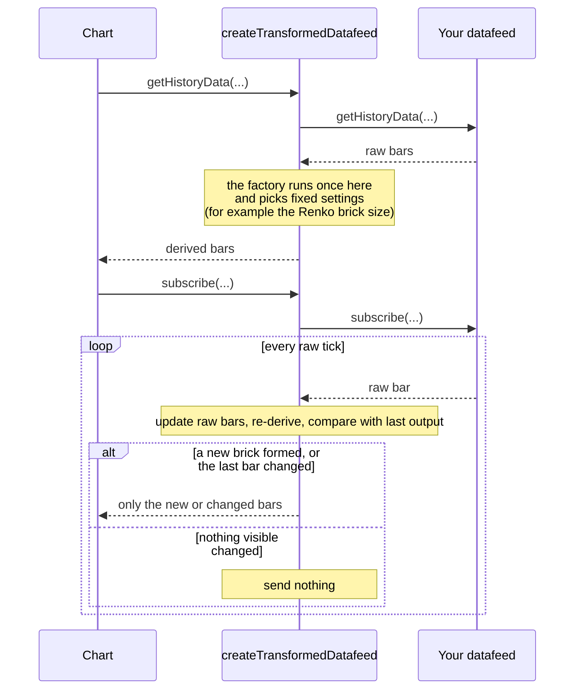

The chart can only replace its newest bar or add new ones. It cannot rewrite older bars,
which is why derived series only change at their end. It is also why they cannot scroll
back past the window they were built from.

## Indicators

An indicator is a function from bars to numbers, plus a description of how to draw them.

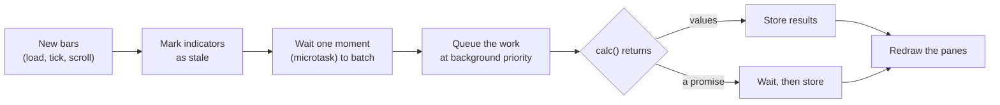

- Each of the ~50 built-in indicators lives in `src/engine/extension/indicator/`.
- `calc` may return a promise. That is how the optional worker mode plugs in without
  changing anything else.
- Your own indicators follow the same shape: see the [plugin guide](./plugin-development.md).

### Optional: workers for very long histories

Off by default. Turn it on with `configureIndicatorWorkers({ enabled: true })`.

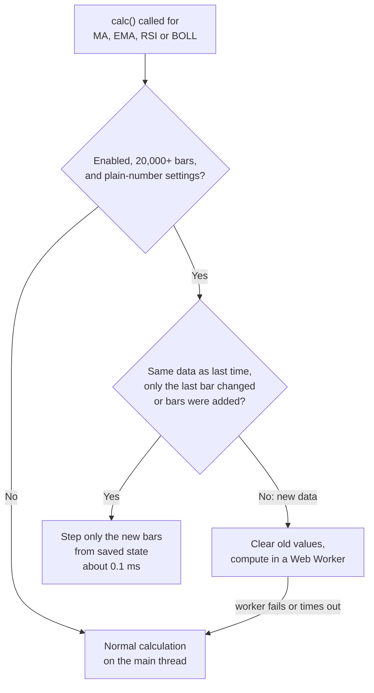

The results are identical either way. A test compares the worker maths to the normal
indicators bar for bar, so turning it on never changes what you see.

## The history cache

Off by default. Turn it on with the `historyCache` prop.

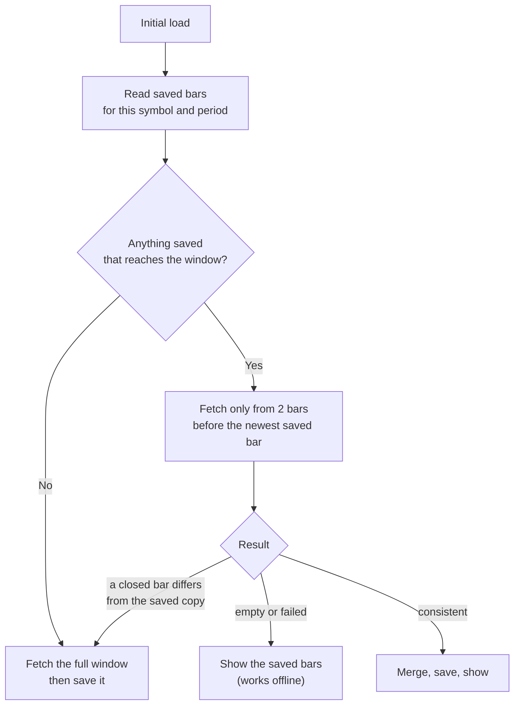

Why each rule exists:

| Rule | Reason |
|---|---|
| Re-fetch 2 bars back | the newest saved bar may have been unfinished; some feeds treat `from` as exclusive |
| A changed closed bar drops the cache | prices were adjusted (a split, a correction), so the saved copy is wrong |
| Never save an empty answer | feeds sometimes return nothing on error; that must not erase good data |
| Saved in the browser's private file store (OPFS) | works offline, needs no server |

## Where the code lives

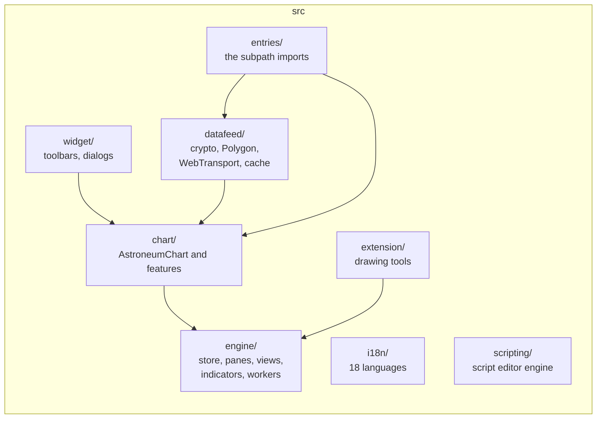

| Folder | Purpose |
|---|---|
| `src/chart` | `AstroneumChart` and chart-level features (replay, multi-chart, alerts, templates, transformed datafeeds) |
| `src/engine` | the drawing engine: store, panes, views, ~50 indicators, optional workers |
| `src/widget` | the UI around the canvas: period bar, drawing bar, dialogs |
| `src/datafeed` | the built-in datafeeds, the binary codec, the history cache |
| `src/extension` | the drawing tools (Fibonacci, Gann, pitchforks, and more) |
| `src/entries` | one tiny file per subpath import such as `astroneum/replay` |
| `src/__tests__` | tests; run them with `pnpm test` |
| `demo/` | the website and the live demo (a Next.js app) |

[CONTRIBUTING.md](../CONTRIBUTING.md) covers setup, the checks to run, and how to add a subpath.

## Releases and deploys

Merging to `main` does the work; nobody runs a release by hand for a beta.

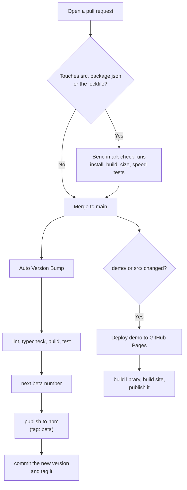

### Cutting a stable release

Betas happen on every merge. A stable version is a deliberate click:

1. Make sure everything you want is merged and the changelog describes it.
2. On GitHub: **Actions → Auto Version Bump → Run workflow**, and pick the bump type.
3. The workflow runs the full checks, publishes with the `latest` tag, commits the
   version, and tags it.

| Bump type | Example: from `0.4.1-beta.7` you get | Use it for |
|---|---|---|
| `prerelease` | `0.4.1-beta.8` | another beta (this is what a merge does) |
| `patch` | `0.4.1` | bug fixes only |
| `minor` | `0.5.0` | new features |
| `major` | `1.0.0` | breaking changes, after 1.0 |

A published npm version can never be reused, so a bump to a number that already exists
fails. Check `npm view astroneum versions` first if unsure.

## Words used in these docs

| Word | Meaning |
|---|---|
| **Bar** or **candle** | one period of trading: open, high, low, close (and volume) |
| **Period** | the length of one bar: 1 minute, 1 hour, 1 day |
| **Tick** | a live price update for the current bar |
| **Datafeed** | the object that supplies bars; four methods |
| **Pane** | one horizontal panel: the main chart or an indicator |
| **Overlay indicator** | an indicator drawn on the price chart (moving averages) |
| **Sub-indicator** | an indicator in its own pane (RSI, MACD, volume) |
| **Drawing** or **overlay** | a shape you draw on the chart (the engine calls these overlays) |
| **Derived series** | bars computed from your bars (Heikin-Ashi, Renko, range bars) |
