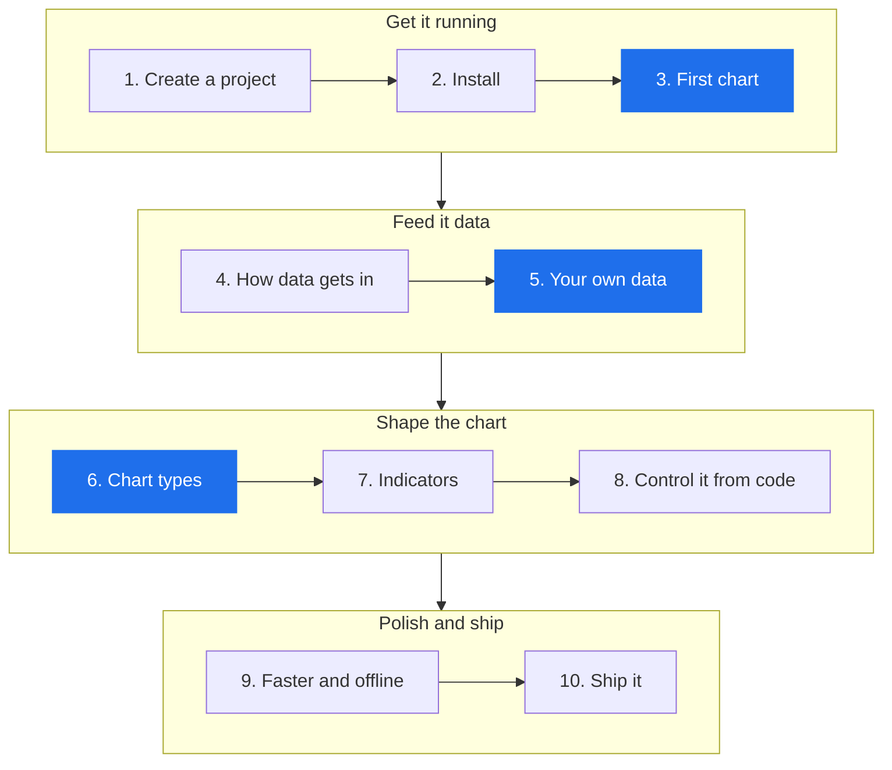
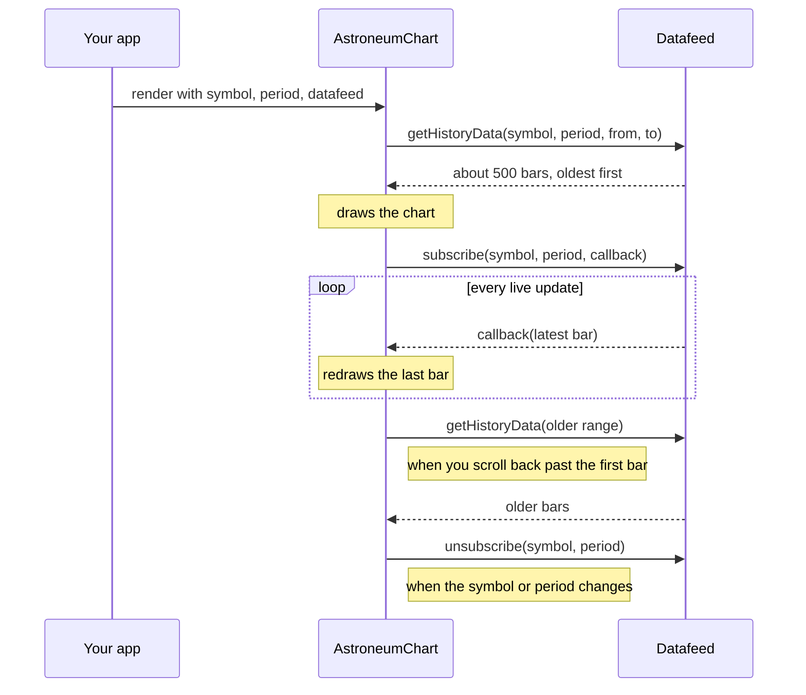
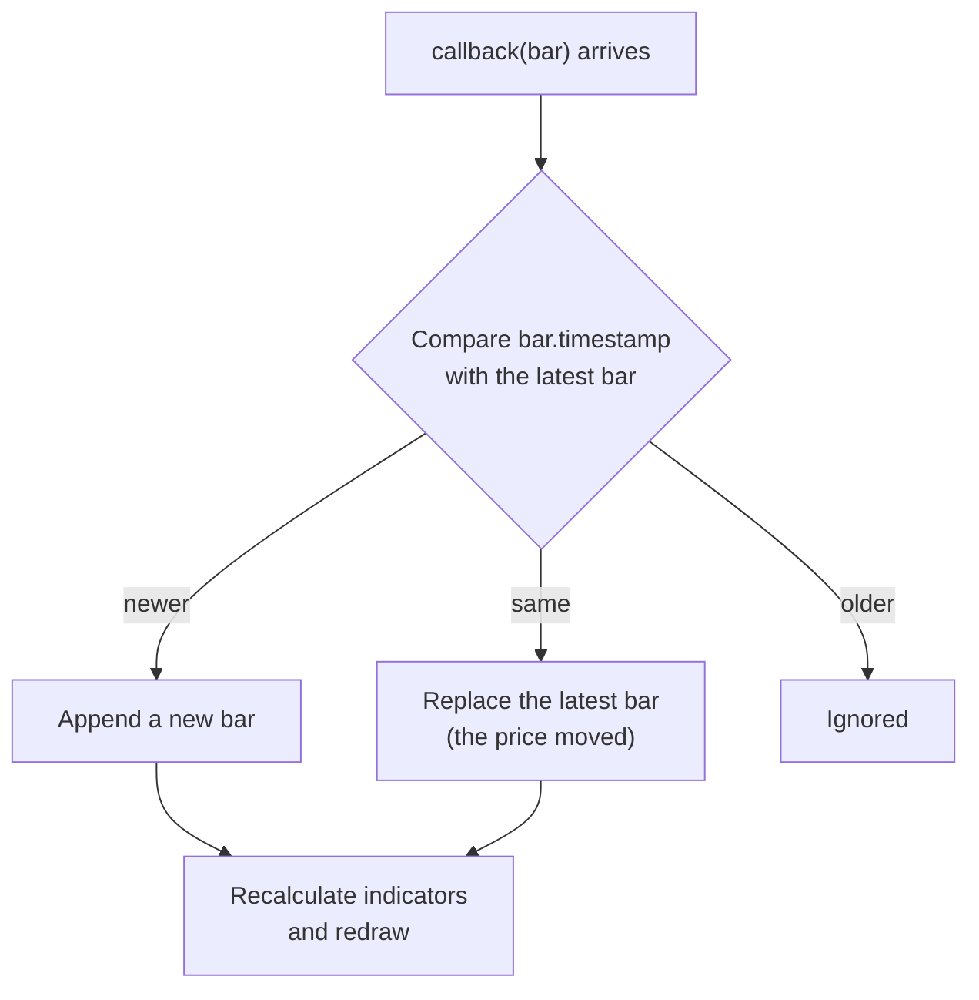
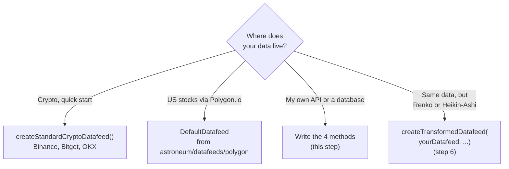
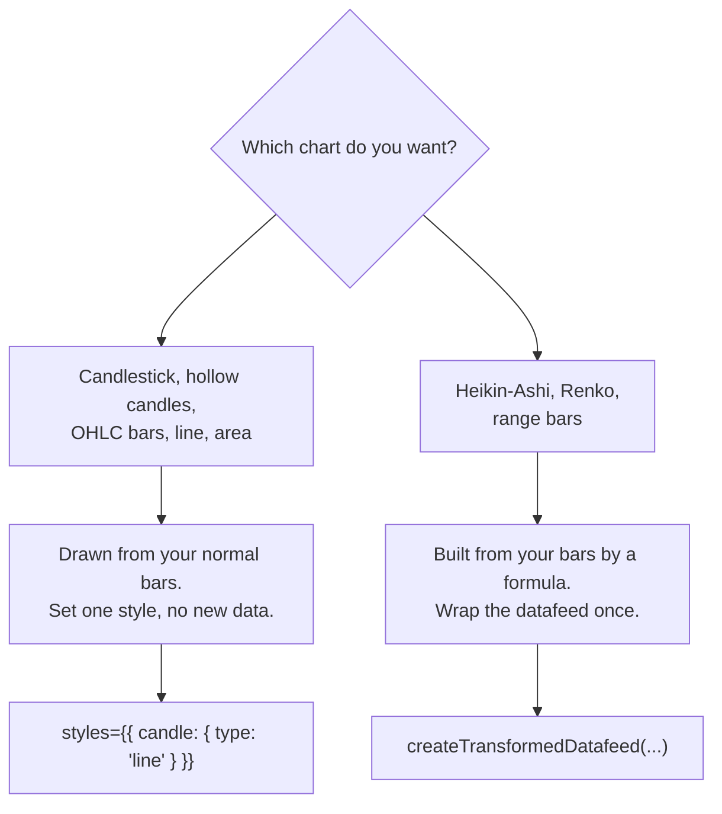
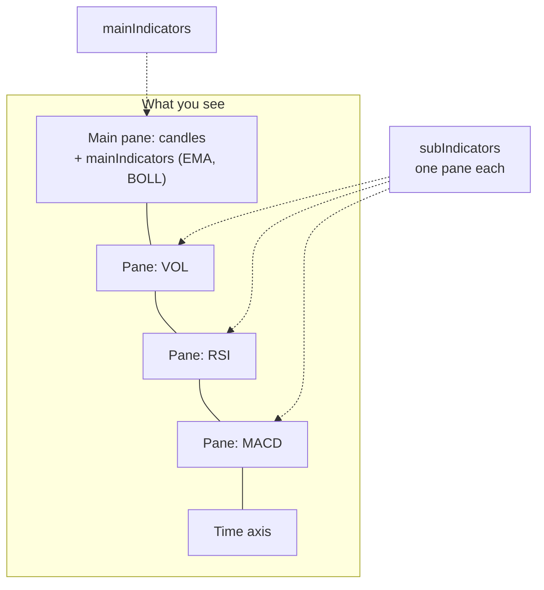
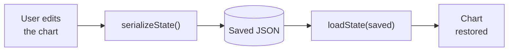
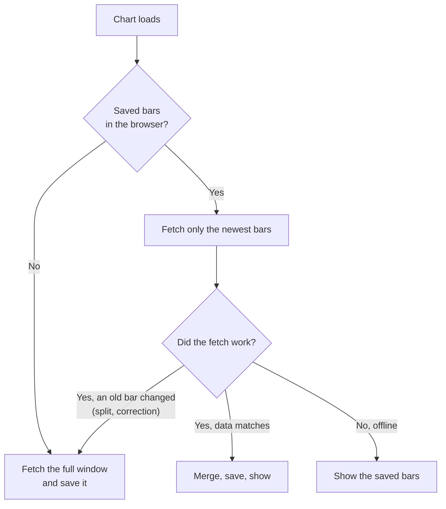
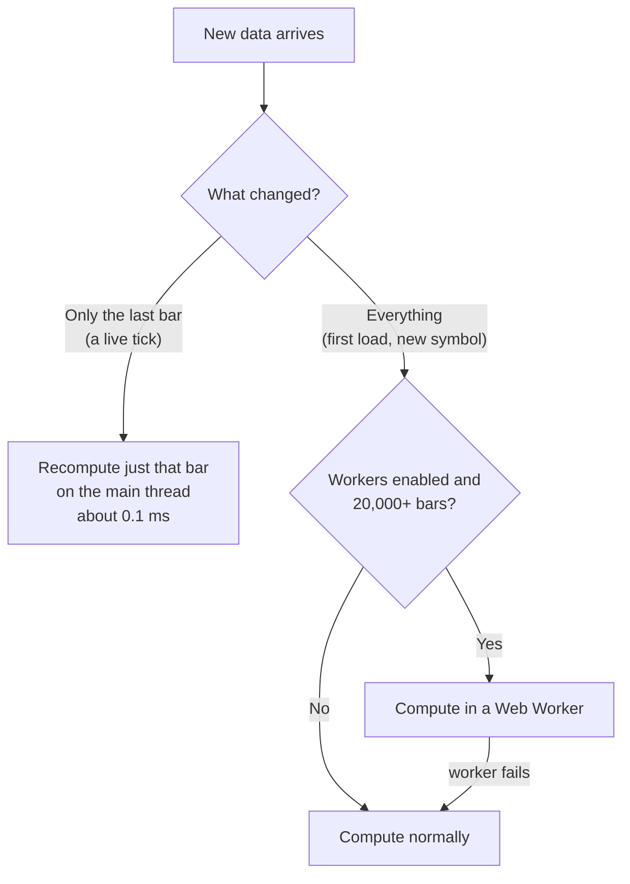
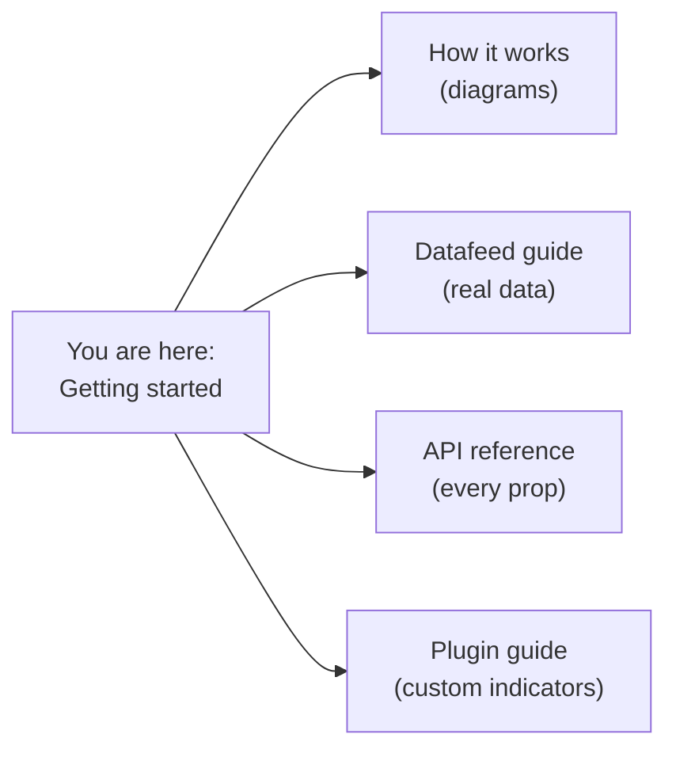

# Getting started: your first chart, step by step

This guide takes you from an empty folder to a live, interactive chart, one small step
at a time. Every step ends with something you can see, so you always know it worked.



The blue steps are the ones most people care about: a chart on screen (3), your own data
(5), and the chart type you want (6). Steps 9 and 10 are optional.

**Want to see the result first?** Open the [live demo](https://kowito.github.io/astroneum/demo/).

## Before you start

| You need | Version | Why |
|---|---|---|
| Node.js | 22 or newer | The package requires it (`engines`) |
| React and React DOM | 18 or 19 | They are peer dependencies |
| A bundler | Vite, Next.js, or similar | The package is ESM and ships CSS separately |

---

## Step 1. Create a project

Skip this if you already have a React app.

```bash
npm create vite@latest my-charts -- --template react-ts
cd my-charts
```

**You should see:** a `my-charts` folder with `src/App.tsx` in it.

## Step 2. Install Astroneum

```bash
npm install astroneum
```

**You should see:** `astroneum` listed under `dependencies` in `package.json`.

## Step 3. Render your first chart

Replace `src/App.tsx` with:

```tsx
import { AstroneumChart, createStandardCryptoDatafeed, STANDARD_CRYPTO_SYMBOLS } from 'astroneum'
import 'astroneum/style.css'

// Create the datafeed once, outside the component.
const datafeed = createStandardCryptoDatafeed()

export default function App() {
  return (
    <AstroneumChart
      symbol={STANDARD_CRYPTO_SYMBOLS[0]}
      period={{ multiplier: 1, timespan: 'hour', text: '1H' }}
      datafeed={datafeed}
      theme="dark"
      style={{ width: '100%', height: 560 }}
    />
  )
}
```

Run it:

```bash
npm run dev
```

**You should see:** a live Bitcoin candlestick chart with three moving-average lines on it (the
default) and a volume pane underneath. Drag to pan, scroll to zoom, and use the toolbar to
switch timeframe or add indicators.

Two things that trip people up, and they are the first two lines of the
[troubleshooting table](#troubleshooting):

1. **Import the CSS.** Without `astroneum/style.css` the chart renders unstyled.
2. **Give the chart a height.** It fills its container, so a container with no height shows
   nothing. `style={{ height: 560 }}` above does that.

## Step 4. How data gets into the chart

Before using your own data, it helps to see what the chart does with a datafeed. A datafeed
is an object with four methods. The chart calls them; you never call them yourself.



| Method | The chart calls it when | You return |
|---|---|---|
| `searchSymbols(search?)` | you type in the symbol search box | `Promise<SymbolInfo[]>` |
| `getHistoryData(symbol, period, from, to)` | it loads the first bars, and when you scroll back | `Promise<CandleData[]>`, oldest first |
| `subscribe(symbol, period, callback)` | history has loaded | nothing; call `callback(bar)` for each live update |
| `unsubscribe(symbol, period)` | the symbol or period changes | nothing; stop sending updates |

A **bar** (`CandleData`) is `{ timestamp, open, high, low, close, volume? }`, with
`timestamp` in milliseconds.

**The one rule for live updates:** send a bar with the *same timestamp* as the latest bar to
update it, or a *newer timestamp* to start a new bar. Older timestamps are ignored.



## Step 5. Use your own data

This is a complete datafeed that needs no server. It makes up a random price and keeps it
moving, which is handy for testing. Replace `src/App.tsx` with:

```tsx
import { AstroneumChart } from 'astroneum'
import type { CandleData, Datafeed, Period, SymbolInfo } from 'astroneum'
import 'astroneum/style.css'

const MINUTE = 60_000
const symbol: SymbolInfo = { ticker: 'DEMO', name: 'Demo market', pricePrecision: 2 }
const period: Period = { multiplier: 1, timespan: 'minute', text: '1m' }

let price = 100
function nextBar(timestamp: number): CandleData {
  const open = price
  price = Math.max(1, price + (Math.random() - 0.5) * 2)
  return {
    timestamp,
    open,
    high: Math.max(open, price) + Math.random() * 0.4,
    low: Math.min(open, price) - Math.random() * 0.4,
    close: price,
    volume: Math.round(Math.random() * 1000),
  }
}

let timer: ReturnType<typeof setInterval> | undefined

const datafeed: Datafeed = {
  // The symbol search box. One symbol is enough for this demo.
  searchSymbols: async () => [symbol],

  // Called with a time range. Return bars inside it, oldest first.
  getHistoryData: async (_symbol, _period, from, to) => {
    const bars: CandleData[] = []
    for (let t = Math.ceil(from / MINUTE) * MINUTE; t <= to; t += MINUTE) bars.push(nextBar(t))
    return bars
  },

  // Send a bar every second. Same minute = update it; new minute = new bar.
  subscribe: (_symbol, _period, callback) => {
    let last = nextBar(Math.floor(Date.now() / MINUTE) * MINUTE)
    timer = setInterval(() => {
      const minute = Math.floor(Date.now() / MINUTE) * MINUTE
      if (minute > last.timestamp) {
        last = nextBar(minute)
      } else {
        price = Math.max(1, price + (Math.random() - 0.5))
        last = { ...last, close: price, high: Math.max(last.high, price), low: Math.min(last.low, price) }
      }
      callback(last)
    }, 1000)
  },

  unsubscribe: () => clearInterval(timer),
}

export default function App() {
  return (
    <AstroneumChart
      symbol={symbol}
      period={period}
      datafeed={datafeed}
      theme="dark"
      style={{ width: '100%', height: 560 }}
    />
  )
}
```

**You should see:** a chart of the made-up market, with the last candle twitching every
second. That is the whole contract: history in, then a stream of updates.

To connect a real source, keep the same four methods and replace the bodies with `fetch`
calls and a WebSocket. [The datafeed guide](./datafeed-guide.md) shows a REST feed and a
WebSocket feed in full.

**Which datafeed should I use?**



## Step 6. Choose a chart type

There are two kinds of chart type, and the difference decides how you set them up.



### Chart types the chart draws itself

Pass one `styles` prop. No other change.

| You want | `candle.type` | Notes |
|---|---|---|
| Candlestick | `'candle_solid'` | the default |
| Hollow candles | `'candle_up_stroke'` | rising candles hollow, falling filled |
| Stroked candles | `'candle_stroke'` | every candle outlined |
| OHLC bars | `'ohlc'` | a vertical bar with open and close ticks |
| Line | `'line'` | the close price; the dot pulses with the live price |
| Area | `'area'` | a line with the area under it filled |

```tsx
<AstroneumChart
  symbol={symbol}
  period={period}
  datafeed={datafeed}
  styles={{ candle: { type: 'line' } }}   // ← the only change
  style={{ width: '100%', height: 560 }}
/>
```

**You should see:** a single price line where the candles were (the moving-average lines stay).
Change `'line'` to `'area'` and the area fills in. You can change `styles` while the chart is mounted; it updates in place.

### Chart types built from your data

Heikin-Ashi, Renko and range bars are not a different way to draw the same bars. They are
*different bars*, computed from yours. Wrap your datafeed with `createTransformedDatafeed`
and pass the result as `datafeed`:

```tsx
import {
  AstroneumChart,
  createTransformedDatafeed,
  generateRenko,
  heikinAshi,
} from 'astroneum'

// Heikin-Ashi: same timestamps, smoothed values.
const heikin = createTransformedDatafeed(datafeed, () => heikinAshi)

// Renko: fixed-size bricks. The factory runs once on the loaded history,
// so the brick size stays fixed while live updates arrive.
const renko = createTransformedDatafeed(datafeed, (history) => {
  const range = history.slice(-100).reduce((sum, bar) => sum + (bar.high - bar.low), 0) / 100
  const brick = Number(range.toPrecision(2))
  return (bars) => generateRenko(bars, brick)
})

<AstroneumChart key="renko" datafeed={renko} /* ...the same props as before... */ />
```

**You should see:** stepped bricks that only move when the price moves a full brick.

Three things to know:

- **Remount when you switch.** The chart reads its datafeed when it mounts, so give it a
  different `key` for each derived datafeed (as `key="renko"` does above).
- **Renko and range bars ignore time.** They use made-up timestamps, so the time axis shows
  synthetic times. That is expected.
- **No scrolling back past the loaded bars** on derived charts; a window of bars is all they
  can be built from.

## Step 7. Add indicators

Indicators are props. Overlays such as moving averages draw on the price chart; everything
else gets its own pane underneath.

```tsx
<AstroneumChart
  symbol={symbol}
  period={period}
  datafeed={datafeed}
  mainIndicators={[{ name: 'EMA', calcParams: [7, 25, 99] }, { name: 'BOLL' }]}
  subIndicators={['VOL', 'RSI', 'MACD']}
  style={{ width: '100%', height: 560 }}
/>
```



**You should see:** the EMA lines and a Bollinger band on the price chart, plus VOL, RSI and
MACD panes beneath it.

- The props **follow changes**: add or remove a name and the chart updates without
  remounting.
- There are about 50 indicators. `getSupportedIndicators()` lists every name.
- `subIndicators={['LINE']}` adds a live close-price line chart in its own pane.
- You can also let users pick indicators from the toolbar; `calcParams` sets the defaults.

## Step 8. Control the chart from code

Attach a `ref` to get a handle. It lets your own buttons drive the chart.

```tsx
import { useRef } from 'react'
import { AstroneumChart, STANDARD_CRYPTO_SYMBOLS } from 'astroneum'
import type { AstroneumHandle } from 'astroneum'

export default function App() {
  const chart = useRef<AstroneumHandle>(null)

  return (
    <>
      <button onClick={() => chart.current?.setSymbol(STANDARD_CRYPTO_SYMBOLS[1])}>Switch symbol</button>
      <button onClick={() => chart.current?.setPeriod({ multiplier: 15, timespan: 'minute', text: '15m' })}>15m</button>
      <button onClick={() => chart.current?.setTheme('light')}>Light theme</button>

      <AstroneumChart
        ref={chart}
        symbol={STANDARD_CRYPTO_SYMBOLS[0]}
        period={{ multiplier: 1, timespan: 'hour', text: '1H' }}
        datafeed={datafeed}
        style={{ width: '100%', height: 560 }}
      />
    </>
  )
}
```

| Method | What it does |
|---|---|
| `setSymbol(symbol)` / `getSymbol()` | change or read the symbol |
| `setPeriod(period)` / `getPeriod()` | change or read the timeframe |
| `setTheme('dark' \| 'light' \| 'high-contrast')` | switch the theme |
| `setStyles(styles)` | change chart styles, such as the chart type |
| `setLocale(locale)` / `setTimezone(tz)` | language and time zone |
| `serializeState()` / `loadState(state)` | save and restore the chart, drawings included |
| `getDataListLength()` | how many bars are loaded |

Saving the user's chart is two calls. `serializeState()` returns plain JSON, so it goes
anywhere: `localStorage`, a URL, or your database.



The [API reference](./api.md) lists every prop and method.

## Step 9. Faster and offline (optional)

Both features are off by default. Turn them on when you need them.

**History cache.** Remembers loaded bars in the browser, so a reload only fetches what is
new, and the chart still opens when the data source is down.

```tsx
<AstroneumChart historyCache /* ...other props... */ />
```



**Indicator workers.** For very long histories (tens of thousands of bars), moves the heavy
indicator maths off the main thread so scrolling stays smooth.

```ts
import { configureIndicatorWorkers } from 'astroneum'

configureIndicatorWorkers({ enabled: true }) // MA, EMA, RSI and BOLL, 20,000+ bars
```



If the browser cannot start a worker, the chart quietly computes on the main thread instead.

## Step 10. Ship it

### Next.js

Add the package to `transpilePackages`, and render the chart from a client component:

```ts
// next.config.ts
const nextConfig = { transpilePackages: ['astroneum'] }
export default nextConfig
```

```tsx
// app/components/Chart.tsx
'use client'
import { AstroneumChart } from 'astroneum'
import 'astroneum/style.css'
// ...
```

The package is safe to import on the server (it does not touch `window` at import time),
so server-side rendering will not crash. The chart itself draws in the browser.

### Everything else

Build as usual. The CSS file is separate (`astroneum/style.css`) so you control how it is
loaded. Optional features are separate imports, so apps that do not use them do not pay
for them:

| Import | Adds |
|---|---|
| `astroneum` | the chart and the common datafeeds |
| `astroneum/replay` | bar replay |
| `astroneum/multichart` | multi-chart grids |
| `astroneum/datafeeds/crypto` | the crypto datafeed on its own |
| `astroneum/datafeeds/polygon` | Polygon.io datafeeds |
| `astroneum/datafeeds/webtransport` | experimental WebTransport datafeed |

---

## Troubleshooting

| What you see | Why | Fix |
|---|---|---|
| Nothing renders, no error | The container has no height | Set `style={{ height: 560 }}` or give the parent a height |
| The chart looks broken or unstyled | The CSS is missing | `import 'astroneum/style.css'` once in your app |
| `window is not defined` | Rendering on the server | In Next.js, put the chart in a component marked `'use client'` |
| Empty chart, no bars | `getHistoryData` returned nothing or threw | Log what it returns; times are in **milliseconds**, oldest first |
| Chart never updates live | `subscribe` never calls `callback` | Call `callback(bar)` with the same or a newer timestamp |
| A new bar shows up in the wrong place | Timestamps are in seconds | Multiply by 1000 |
| Switching to Renko or Heikin-Ashi shows the old chart | The chart keeps its first datafeed | Give the chart a different `key` for each datafeed |
| `Unsupported engine` on install | Node is older than 22 | Upgrade Node |
| Crypto data does not load | A network or region block on the exchange | Try another exchange symbol, or use your own datafeed |

## Where to go next



- [How it works](./architecture.md): the parts of the chart and how data moves through them
- [Datafeed guide](./datafeed-guide.md): connect a REST API or WebSocket
- [API reference](./api.md): every prop, method and export
- [Plugin guide](./plugin-development.md): write your own indicator
